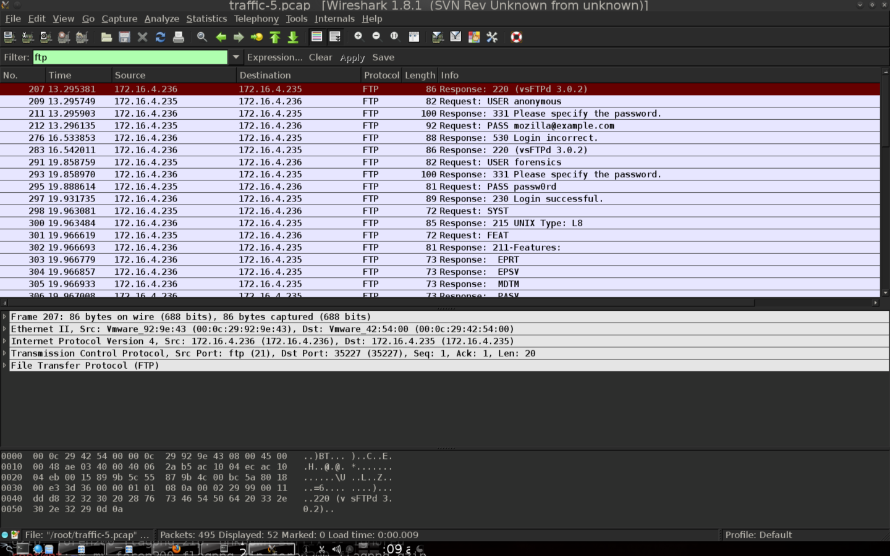
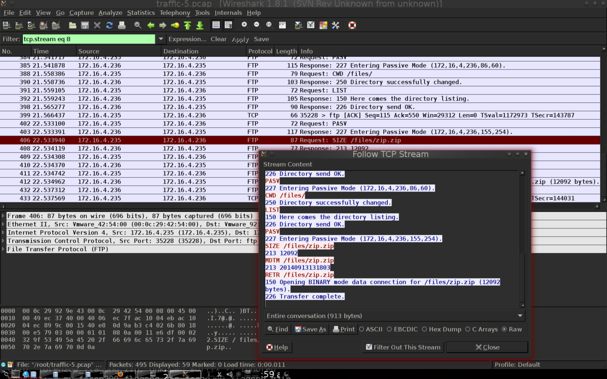
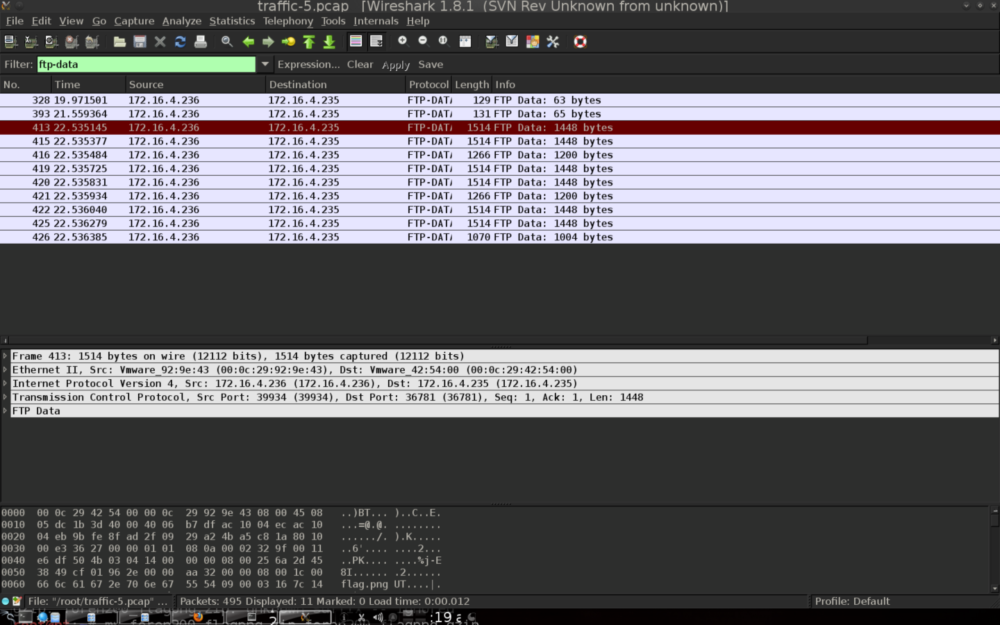
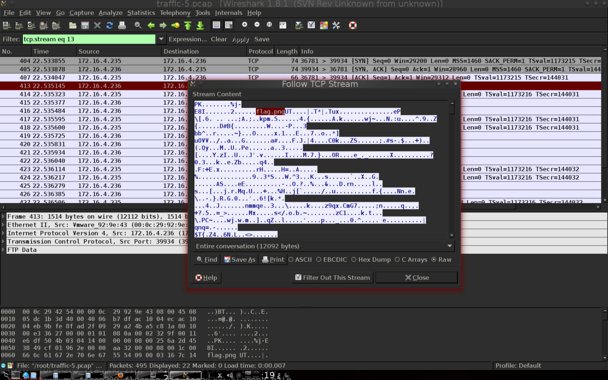

# why not sftp? writeup
    CSAW CTF, 2014
    Writeup by clampz

We are given a pcap file, traffic-5.pcap. I chose to use my favorite tool for packet analysis: [wireshark](https://www.wireshark.org/)

Initially, my thoughts were to look for any suspicious looking FTP traffic. Following this approach - I filtered the results searching for any ftp traffic.


We are able to see in plain text that there is a failed login attempt followed by a successful one with the user 'forensics' and password 'passw0rd'. After following the tcp stream containing this packet, I was able to see that there was a request for a file '/files/zip.zip'.


I then decided I should try to find the tcp connection for the 'files/zip.zip' retrieval. I preformed a search for any ftp-data traffic.


Following the tcp stream for the larger sized data we see in clear text an indicator that we are on the correct path, 'flag.png'!


I saved this conversation in the raw format with the filename 'zip.zip', confirmed the filetype, unzipped, and was rewarded with a 'flag.png' image of the flag.
```
root@bt:~# file zip.zip 
zip.zip: Zip archive data, at least v2.0 to extract
root@bt:~# unzip zip.zip 
Archive:  zip.zip
  inflating: flag.png                
root@bt:~# 
```


